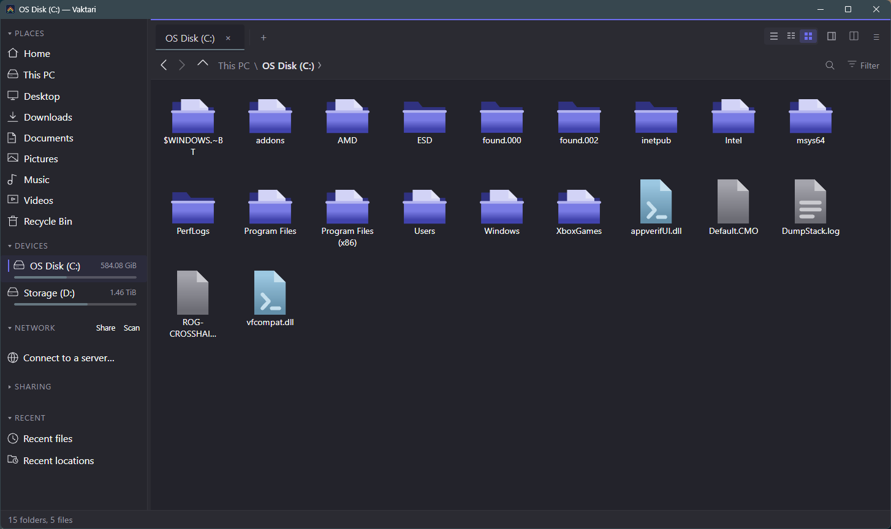

<div align="center">


# Vaktari

**A fast, keyboard-friendly file manager for Linux and Windows desktops.**

It reads your desktop's own settings — icon theme, click behaviour, trash,
bookmarks and file types — rather than keeping its own copy of them.

Colours and typeface default to the design reference rather than your desktop,
and can follow it instead; see [Fitting your desktop](#fitting-your-desktop).
Windows is newer than Linux and still has gaps — see [Status](#status).

</div>



<sub>Grid view at the filesystem root.</sub>

---

## Getting around

**Tabs and split view.** Open as many tabs as you like, and press `F3` to split
the window in two. Each side keeps its own tabs, history, selection and zoom
level, so you can compare two folders without either side forgetting where it was.
Copy or move between them from the right-click menu.

**A path bar that works both ways.** Click any part of the breadcrumb to jump to
that folder, or press `Ctrl+L` to type a path. Typing offers completions as you
go, and `Tab` cycles through them. `%ProgramFiles%`, `%SystemDrive%`, `~` and
`$HOME` are understood, along with `%Documents%` and its neighbours.

**Type to jump.** Start typing in any listing and the selection moves to the first
matching name — no dialog, no search box.

**`F1` lists every shortcut**, so none of the above has to be remembered.

**Back, forward, up** on `Alt+←`, `Alt+→`, `Alt+↑`, and `F5` to refresh. If your
mouse has the two buttons under the thumb, they go back and forward too — in a
split, they move whichever half the pointer is over.

## Seeing your files

**Three layouts**, from the toolbar or `F8`:

- **List** — one file per row, with sortable columns for size and date. Columns
  drop out gracefully as the pane narrows rather than being squeezed into
  uselessness.
- **Compact** — names in vertical columns, for fitting a lot of files on screen.
- **Grid** — large icons and thumbnails.

**Independent zoom per layout and per pane.** `Ctrl` with the scroll wheel resizes
text and icons in the pane under your pointer, and each layout keeps its own
size — a grid tile and a list row want different proportions — and remembers it
between sessions. Add `Shift` for icons only; `Ctrl+0` resets.

**Thumbnails** for images and video, cached so a folder you have visited draws
instantly. A file too small to enlarge cleanly keeps its icon rather than being
blown up into a blur.

**Grouping** by name, size, type or date, from the right-click menu.

**Details panel** (`F11`) — preview, full path, size, type, dates and permissions
for whatever is selected. Drag the edge between it and the listing to resize it;
each side of a split keeps its own width and its own panel, so the panel always
describes the side you are looking at. If the window is too narrow to show it
usefully, Vaktari can widen the window to make room and shrink it back when you
close it.

**Quick preview** (`Space`) — a larger look at the selected file without opening
anything.

## Finding things

**Search** from the toolbar — `Ctrl+F`, or the magnifier beside the path — with
results streaming in as they are found rather than all appearing at the end. The
field folds back into its icon when you leave it empty.

**Filter** the current listing with `Ctrl+I` — type to narrow what is on screen,
`Escape` to clear.

**Recent files** and **recent locations**, banded by day. Any entry can be
forgotten individually, which removes the record and never the file.

**Add a folder to places** with `Ctrl+D` to keep it in the sidebar, and
right-click one to remove it again. Only the places you added offer that — Home,
your drives and your network shares are the desktop's, not yours to drop.

## Selecting

**Drag a box** across empty space to select everything it touches — in any
layout, including the list, where you can start the drag from the blank part of
a row. Hold `Ctrl` or `Shift` to add to what is already selected, and drag past
the edge to keep going as the view scrolls.

`Ctrl+A` takes everything, `Ctrl` and `Shift` clicking work as you would expect,
and the status bar keeps a running count and total size of what you have picked.

## Working with files

Copy, cut, paste, rename, duplicate and delete with the shortcuts you would
expect. Beyond that:

**Undo** (`Ctrl+Z`) for file operations.

**Trash that can actually restore.** Deleted files go to your desktop's trash and
appear in Vaktari's Trash view, each showing where it came from — so *Restore*
puts it back where it belongs rather than guessing. Emptying always asks first,
and says what it removed, or why it could not. Vaktari can also sweep the trash
after a number of days, or when it grows past a share of the disk.

A row in that view names where the file *used to be*, so deleting or renaming one
would act on whatever sits there now — possibly a new file of the same name.
Vaktari refuses those and says so: *Restore* and *Empty* are what the bin is for.

**Rename in bulk** (`Shift+F2`), with a live preview of every result before
anything changes.

**New file, new folder, new from template** — new items open straight into rename
so you can name them without a second click. Templates come from your
`~/Templates` folder, alongside a set of built-in file types.

**Open with** lists the applications actually registered for that file type,
and *Choose another app…* opens your system's own picker — the one that can
browse for an executable and remember the choice.

**Open terminal here** (`F4`).

**A right-click menu that shrinks to fit.** Entries that need a selection are not
offered when there is none — right-clicking empty space shows what applies to the
folder, and right-clicking a file selects it first. Keyboard shortcuts appear
beside the entries that have them.

**Opening a folder from elsewhere.** Vaktari can register as the program that
opens folders and drives, from Settings — so double-clicking a folder anywhere
opens it here, as a tab in the window you already have rather than a second copy
of the application. Pass it a file and it opens that file's folder, which is what
makes `vaktari ~/Downloads/thing.zip` useful from a script or a launcher.

One thing it cannot do, and no file manager on Windows can without replacing
parts of the shell: **"Show in folder" from Chrome, Edge and Firefox always
opens Explorer.** Those browsers call a Windows function that opens an Explorer
window directly rather than asking the system what should open a folder, so
there is no setting or registration that redirects it.

**Checksums.** The properties window computes a file's hashes on request — only
when you ask, since hashing a large file is not free — and the result is
selectable so you can copy it.

**Scripts.** Drop a script in Vaktari's scripts folder and it appears in the
right-click menu, receiving the current folder and selection.

## Version control

Inside a git repository, files are marked with their status: **M** modified,
**A** added, **D** deleted, **?** untracked, **!** conflicted. A folder shows the
strongest state of anything inside it.

The marks appear in every layout and keep up as you work — when you edit a file,
and when you commit or switch branch. Status is read once per folder rather than
once per file, so it stays cheap on a large repository. The letters carry the
meaning and the colours are decoration, so the marks remain readable if you cannot
tell the colours apart.

## Network and sharing

**Connect to a server.** Shares appear in the sidebar and browse like local
folders. On Linux that is SFTP, SMB and anything else your desktop can mount; on
Windows it is SMB and, with the WebClient service, WebDAV — and if a share wants
a password, Windows asks for it in its own dialog and remembers it.

**Discover shares** on your network without typing addresses. Whatever is
announcing itself — a NAS, another desktop, a Vaktari share on another
machine — shows up ready to connect.

**Share a folder over HTTP** for another machine to fetch, with optional upload.
This uses [copyparty](https://github.com/9001/copyparty) when you have it
installed.

## Fitting your desktop

Vaktari reads your desktop's configuration rather than keeping its own copy:

| | |
|---|---|
| **Light or dark** | follows your desktop, or whichever you pick |
| **Colour scheme and accent** | the design reference's own, or your desktop's if you ask |
| **Icon theme** | your themed icons, with hand-drawn fallbacks where a theme has none |
| **Font** | the design reference's typeface, or any family you choose |
| **Single or double click** | follows your desktop setting |
| **Trash** | the standard desktop trash, shared with every other application |
| **Bookmarks** | the same places list your other file manager uses |
| **File types** | your system's own file-type database |

Change your icon theme and Vaktari changes with it. Nothing needs restarting.

On Windows there is no icon theme to follow, so Settings offers three choices
instead: the bundled set, the icons Windows itself draws, or a freedesktop theme.
Vaktari can fetch one for you — Papirus, with its light and dark variants — which
is worth doing rather than downloading it yourself, because those themes are
built out of tens of thousands of symbolic links and Windows will not create one
without Developer Mode. An archive you found elsewhere can be installed the same
way, from a `.tar.gz`, `.tar.xz` or `.zip`. Unpacked inside Vaktari the links are read rather than
made, so nothing fails and nothing is duplicated on disk.

Colour and typeface are the exception, and a deliberate one: the bundled scheme
is the default, because a file manager that repaints itself to match your desktop
the first time you launch it is a surprise rather than a courtesy. Turn on
*Follow desktop colours* — Settings, under *View modes* — and your scheme and
accent are layered over it instead; choose a font in Settings and it is used
throughout. Sizes and dates keep the monospaced face either way, so figures still
line up down a column.

**Light and dark are a separate choice**, in the same place — *Follow the
desktop*, *Light* or *Dark*. Following the desktop is the default and the only
one that keeps up when you change your desktop with Vaktari already open; the
other two hold whatever you pick, whether or not that matches the rest of your
machine. The bundled scheme is drawn for both, so neither is an inversion of the
other.

## Keyboard

| | | | |
|---|---|---|---|
| `Enter` | open | `Ctrl+C` `Ctrl+X` `Ctrl+V` | copy, cut, paste |
| `Backspace` | back, or up — a setting | `Delete` | move to the bin |
| `Alt+←` `Alt+→` | back, forward | `Shift+Delete` | delete permanently |
| `Alt+↑` | up one folder | `Ctrl+Z` | undo |
| `Ctrl+A` | select everything | `F2` | rename |
| `Ctrl+T` | new tab | `Shift+F2` | rename in bulk |
| `Ctrl+1`…`Ctrl+9` | jump to a tab | `Alt+↑` | up one folder |
| `Ctrl+W` | close tab | `Ctrl+Shift+N` | new folder |
| `Ctrl+Tab` `Ctrl+Shift+Tab` | next, previous tab | `Alt+Enter` | properties |
| `F3` | split view | `F4` | terminal here |
| `Tab` | switch split side | `F5` | refresh |
| `F8` | next layout | `Space` | quick preview |
| `F11` | details panel | `Ctrl+H` | show hidden files |
| `Ctrl+L` | edit the path | `Ctrl+D` | add this folder to places |
| `Ctrl+F` | search | `Ctrl+B` | show or hide the sidebar |
| `Ctrl+I` | filter the listing | `Ctrl+Shift+,` | settings |
| `Escape` | clear the filter | `Ctrl` `+` `−` `0` | zoom in, out, reset |

## Settings

One dialog (`Ctrl+Shift+,`) covers sorting, what a click does, previews and their
size limits, confirmations, the status bar, which entries appear in the
right-click menu, per-layout spacing, date style, the font, light or dark,
version-control marks, the details panel's behaviour, and how the trash is swept.

Vaktari can also remember the view, sort order and zoom for each folder
individually, if you would rather not set them again every time.

## Installing

Both builds are on the
[releases page](https://github.com/dkflint723/vaktari/releases), and what changed
in each one is in [CHANGELOG.md](CHANGELOG.md).

### Linux

```bash
tar -xzf vaktari-linux-x64.tar.gz
cd vaktari && ./install.sh
```

It installs under `~/.local`, needs no root, and adds a menu entry. There is an
RPM for Fedora on the same page.

**Pick one or the other.** `~/.local/bin` comes before `/usr/bin` on most
systems, so a copy installed this way keeps running even after you upgrade the
package — `vaktari --version` prints the version and the file it came from, which
is the quickest way to tell which one you have.

### Windows

Run `vaktari-<version>-win-x64-setup.exe`.

It installs for your account only, so it needs no administrator and raises no
UAC prompt, and it removes from *Installed apps* like anything else. The first
page offers *Install for all users* if you would rather have it on the machine
than the account.

Uninstalling leaves your tabs, places and folder views where they
are, under `%LOCALAPPDATA%\vaktari` — so reinstalling or upgrading picks up
where you left off. Delete that folder by hand if you want them gone, but note
that it also holds your settings, your recent folders and the `scripts\` folder
with any scripts you wrote yourself — check that first if you would rather keep
them.

**To build it yourself** you need the .NET 10 SDK:

```bash
git clone https://github.com/dkflint723/vaktari.git
cd vaktari
dotnet run --project src/Vaktari.Ui
```

Prerequisites, other distributions and packaging are in [BUILDING.md](BUILDING.md).

## Status

Vaktari is used daily by its author, but there has been no stable release and
version numbers should not be trusted yet. Known gaps:

- **In a git submodule the marks wait for a refresh** after a commit rather than
  updating on their own.
- **Selection mode, configurable shortcuts and multiple windows** are not built.
- **Windows is newer than Linux.** It browses, lists drives, opens files,
  copies, moves, renames, recycles, connects to and discovers network
  shares, serves a folder over HTTP, and follows the system light/dark mode and
  accent. The Recycle Bin is browsable, and *Restore* puts a file back where it
  came from — beside whatever has since taken the name, rather than over it.
  Missing: the shell's per-file icons. Search matches file *names* only: on
  Linux, Vaktari can hand the query to Baloo and search inside files where KDE
  indexes them. Pins in Explorer's Quick Access are not imported, though the
  older Links and Network Shortcuts folders are. SFTP and FTP are Linux-only,
  because Windows has no redirector for them. See [WINDOWS.md](WINDOWS.md).

Bugs and ideas are welcome on the
[issue tracker](https://github.com/dkflint723/vaktari/issues).

## Licence

MIT — see [LICENSE](LICENSE).

Built with [Avalonia](https://avaloniaui.net). Published binaries include
SkiaSharp, HarfBuzzSharp and the Inter typeface; their licences travel with the
release.
