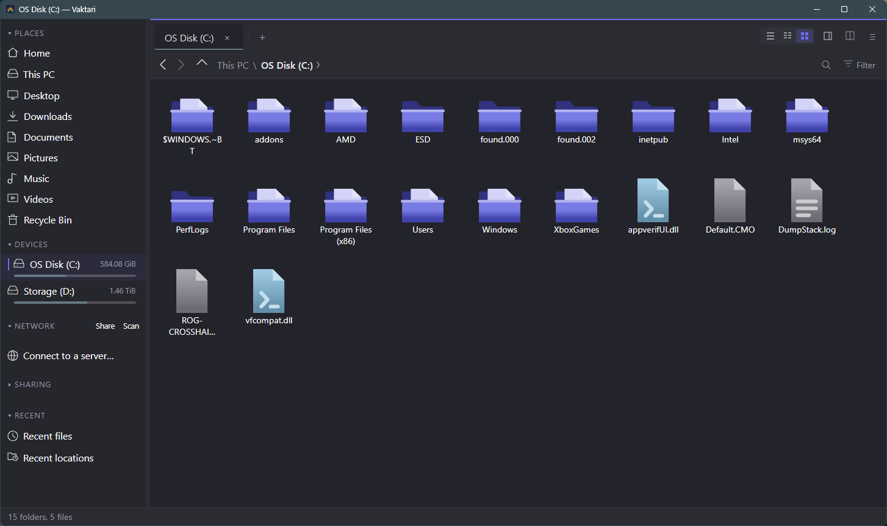

<div align="center">


# Vaktari

**A fast, keyboard-friendly file manager for Linux and Windows.**

It reads the desktop you already have — your trash, your bookmarks, your icon
theme, your file types, whether a single click opens — rather than keeping a
second copy of all of it.

[Install](#install) · [Keyboard](#keyboard) · [Known limits](#known-limits) · [Changelog](CHANGELOG.md)

</div>



<sub>Large grid at the root of a drive, on Windows.</sub>

---

## What it is like to use

A few things you would notice in the first ten minutes:

- **One zoom gesture covers everything.** Hold `Ctrl` and scroll, and you run
  from a dense list of names all the way up to a wall of 256-pixel thumbnails —
  the pane changes layout on the way rather than making you pick one first.
- **A search is somewhere you go**, not a popup over the folder. It has its own
  tab, its own place in Back and Forward, and it is still there after a
  restart.
- **Nothing waits its turn.** Start a second copy while the first is running,
  and cancel just the one you meant. (Pause belongs to the bar, and the bar
  follows whichever transfer you started last.)
- **One failure does not end the batch.** The rest goes through, and a *Retry
  3* button goes again on only the three that did not.
- **It tells you the truth.** When a search has no index behind it, it says so.
  When a limit is reached, it says that is a limit rather than an answer. When
  a search of contents skips a file too big to read, or one kept online, it
  says how many.
- **Nothing to install alongside it.** The published builds are self-contained
  — no runtime, no framework, no extra downloads.

---

## Getting around

**Tabs, splits and windows.** Open as many tabs as you like — drag to reorder
them, middle-click to close one, double-click the empty strip for a new one.
Right-click a tab for *Duplicate*, *Close*, *Close other tabs*, *Close tabs
to the right* and *Reopen closed tab* — the closing rows only when there is a tab for
them to close, and the reopening row only when that side has closed one; each side of the window remembers its last ten.
`F3` splits the window in two, each half with its own tabs, history, selection
and zoom, and `Tab` moves between them. `Ctrl+N` opens a whole second window on
the folder you are in. Every window is a peer, and all of them come back when
you next launch.

**A path bar that goes sideways and downwards.** Click any part of the
breadcrumb to jump there, or press the separator after a folder name to list
that folder's own subfolders and go straight into one. Every crumb has a menu,
including *This PC* at the very front — so the machine's other drive is one
press away without a trip to the sidebar. When the window is too narrow for the
whole path, the `…` that replaces the middle is itself a menu of exactly the
folders it stands for.

**Or type it.** `Ctrl+L` (or `Alt+D`) puts the cursor in the path. A list of
the folders you could mean drops down as you type; `Tab` completes shell-style.
Relative paths (`..`, `src`, `../sibling`) count from the folder on screen, and
`%ProgramFiles%`, `%SystemDrive%`, `~`, `$HOME` and `%Documents%` and its
neighbours are expanded. Type a path to a *file* and it opens that file,
landing you on its folder with the row lit.

**Back and forward remember the whole walk.** Right-click either chevron for a
list of where it goes, nearest first, twelve deep — and picking a row several
steps back leaves both buttons exactly as that many presses would have. A third
chevron beside them lists the folders you have recently been in, which reaches
across tabs and windows as Back and Forward cannot — those two belong to one
tab's own walk, though each tab's stacks are saved with the session and come
back with it.

If your mouse has the two buttons under the thumb, they go back and forward
too. In a split, they move whichever half the pointer is over.

**Backspace is yours to choose.** Out of the box it goes back, the way Explorer
does; Settings ▸ General makes it go up to the parent instead, the way
Dolphin does. `Alt+←` and `Alt+↑` keep doing their own jobs either way, and the
`F1` sheet prints whichever one Backspace is currently doing.

**There is somewhere above a drive.** *This PC* (*This computer* on Linux) is a
real listing of your drives and their capacities — reachable by Up from the top
of a drive, from a crumb above every path, from the sidebar, or by typing its
name into the path bar.

**Type to jump.** Start typing in any listing and the selection moves to the
first matching name. Letters accumulate, so d-o-c finds Documents; press the
same letter again to cycle through the names that start with it.

**`F6` moves the keyboard** between the listing, the path bar and the sidebar
in turn — and `F1` lists every key the window answers, cross-checked against
the real bindings by a test so it cannot fall behind the application.

## Seeing your files

**Three layouts** — *List*, *Small grid* and *Large grid* — one click each on
the toolbar, or `Ctrl+Shift+1`, `2`, `3`. (`F8` flips between List and Large
grid.) The choice belongs to the pane, so the two halves of a split can differ.

Sizes are the pane's too. `Ctrl` and the wheel scale the pane under the
pointer, `Ctrl+Shift` and the wheel its icons alone, and `Ctrl`+middle-click
puts it back. If you would rather type a number than find it by scrolling, the
view-options menu has *Text size* and *Icon size* as steppers, with a chooser
above them saying whether they act on the left pane, the right one or both.

**The two sides of a split can be compared.** *Compare the two sides*, in the
view-options menu, under *Analyse* on the folder's right-click menu, or in the
command box, marks
every row that differs from the other side's folder: *Only here*, *Newer*,
*Older*, or *Different* for a file and a folder of one name, or two files
changed at the same moment at different sizes. Two files the same size
changed less than two seconds apart count as the same, because FAT keeps
times in two-second steps. Nothing is allowed for daylight saving: FAT keeps
local time, so after the clocks change a stick's files can read an hour newer
or older. The marks follow either side as it changes, the status bar counts
them and what is missing here, and *Select what differs from the other side*
selects them. It compares one level, so two folders of the same name are not
looked inside, and it compares hidden files only while both sides show them.
It compares folders it has read to the end: while either side shows search
results, the bin, a recent list or the list of drives, is still loading, or
could not be read, nothing is marked and the status bar says why. Closing the
split stops it.

**What is newer or missing on one side can be copied to the other.** Right-click
the empty space of the side to copy from and choose *Analyse ▸ Copy what is
newer or missing here to the other side*, or run it from the command box. It copies the rows marked
*Only here* and *Newer* that the listing shows into the other side's folder,
after a prompt that says how many it copies, to which folder, and how many
older files it replaces for good. Rows marked *Older* or *Different* stay
where they are, and so does a folder on both sides, since it copies one
level. A folder the other side is inside is left out, as is a name Windows
cannot open, and the status line says so. Each clash is decided when the copy
reaches it: a file that has turned up on the other side by then, or become
the newer one there, is left alone, and the operation bar names what was.
Ctrl+Z takes the copies back, though not the older files they replaced.

**The List layout chooses its columns.** Name, Type, Size, Modified and
Created, with Type and Created off until you ask for them; right-click the
headings or use *View ▸ Columns*. Drag the right edge of any heading but Name
to make its column wider or narrower — Name takes whatever is left — and every
pane follows; *Reset column widths*, in the same two menus, puts them all back.
All five sort. Clicking Size, Modified or Created starts descending, so the
download that just finished is at the top. `file2` sorts before `file10`, and
*Écoles* sorts beside *Ecoles* rather than after *Zebra*. Sorting folders before
files is a switch you can turn off, which is what finally lets "sort by
Modified" answer *what changed here* when the answer is a folder.

**What is using the space in a folder.** *Show space usage*, under *Analyse* on
the folder's right-click menu or in the command box, replaces the listing with one row for each item in the
folder, each carrying everything underneath it. Click the *Size* heading and the
biggest thing is at the top, folder or file — folders are not banded above the
files here, because the question is what is large rather than what is a folder.
The bar above says what the whole folder came to, and how many folders it could
not read: a total that stepped over one silently would look exact while being
short by whatever was behind it. Links are counted where they stand and never
followed, so a folder of shortcuts is its own size rather than the size of what
it points at. Hidden items count towards the total and appear as rows only while
hidden files are shown. It measures when you ask and never on its own, since
walking a tree costs what it costs. It is a view of one folder rather than a
folder itself: copying across, the folder's properties and pinning are not
offered in it, and comparing marks nothing there. *Open file location*, on a row's right-click menu, goes into a folder
row and shows a file row lit in its folder, and Back (`Alt+←`) returns to the
folder that was measured.

**The files that are copies of each other.** *Show duplicate files*, under
*Analyse* on the folder's right-click menu or in the command box, replaces the listing with every file below
this folder that another file holds the same bytes as — whatever it has been
renamed to, and whatever its date says. The bar above says how many sets there
are and what deleting all but one of each would give back. Every copy is a row,
with the date it was written, because which one to keep depends on where it
lives and when it was written, and that is not a choice a scan can make for
you. *Select every copy but one* picks the spare ones and always leaves a
member of each set behind, so selecting what it offers and pressing Delete
cannot take the last copy of anything. It reads only what it must: a file whose
size nothing else shares is never opened, and what survives that is compared
byte for byte rather than trusted to a digest, because the cost of a collision
here is somebody deleting a file that was not a copy. Empty files are left out,
since every one of them matches every other. Like the space listing it is a
view rather than a folder: *Open file location* shows the selected copy lit in
its own folder, and Back (`Alt+←`) returns to the folder that was scanned.

**Folders open where they stand.** In the List layout, press the triangle on a
folder row — or `→` with the row selected — and its contents appear underneath
it, indented, without the listing moving. `←` closes it again. What you opened
survives a sort, a refresh, a rename and a paste.

**Grouping** by name, size, type or date, from *View ▸ Group by*. Each
band's heading says how many rows are under it — TXT (12) — and clicking a
heading selects the whole band. This is a List-layout feature; the grids draw
no bands.

**Thumbnails** for pictures, and more besides. On Windows they come from the
same store Explorer draws from, so a video shows a frame and a PDF shows its
first page — whatever a handler on your machine can render. On Linux, Vaktari
decodes images itself and reads whatever your desktop's own thumbnailers have
already put in the shared cache. Either way, a picture too small to enlarge
cleanly keeps its icon rather than being blurred up, and there are size limits
you can set — with a separate one for network shares, since a thumbnail there
pulls the whole file across.

**Two names the eye cannot tell apart get marked.** `Ember Setup 0.1.0 .exe`
beside `Ember Setup 0.1.0.exe` differ by one space — legal, distinct to the
filesystem, and invisible in any listing including Explorer's. Vaktari labels
them *Look-alike*. Whitespace and case only, so an unusual name is not flagged
merely for being unusual.

**Extensions can be hidden, but not dangerously.** Turn *Show file name
extensions* off and `notes.txt` draws as `notes` — except for endings that mean
something *happens* when you open the row. A program, script, installer or
launcher keeps every character, so `invoice.pdf.exe` can never be listed as the
document beside it.

**Details panel** on `F11` — a large preview, the name, size, type, dates,
where a link points, and permissions on Linux or file attributes on Windows.
Drag the edge to resize it; each side of a split keeps its own. If the window
is too narrow, Vaktari can widen it to make room and shrink it back afterwards.
`Space` gives a quicker look without opening anything.

**Small touches worth knowing.** Hidden files (`Ctrl+H`) look hidden — ghosted
rather than standing at full strength beside real content. The Modified column
is shaded by how recently a file changed. A name too long for its column is cut
in the *middle*, so the extension survives. Folder rows can count what is
inside them. Tick boxes on rows are available if you want them, off by default.

**Folders can remember how you left them** — layout, sort, grouping, hidden
files, which columns were ticked and both zoom levels. It is off by default and
lives in Settings ▸ Folders and lists, and the record is kept centrally rather
than written into your folders. A `.directory` file Dolphin already left in a folder
is still read, so a folder somebody configured elsewhere opens the way they
meant. *Use this view for all folders*, in the view-options menu, goes the
other way: it makes the pane you are looking at the way folders open from now
on, and forgets the views individual folders were given.

## Finding things

**`Ctrl+F` opens the search field**; Enter asks the question. Nothing runs
while you type, so there is no pause to type through. Results are ordinary rows
in an ordinary listing — select five of them, drag one out, rename in place,
sort by size, or open a second search beside the first in a split.

A band above the results says what was asked and where it looked, with a tick
box reading *Only in Documents*, on by default for a search started in a
folder. Clear it and the search leaves that folder. Ticking or clearing it
counts as a navigation rather than an edit in place, so Back takes you to the
previous question instead of making you retype it. Nothing is cached between
searches, so it is asked again. On Windows a *Match case* box sits beside it,
and on both platforms a *Search contents* box, off by default.

**Search contents finds a file by what is in it** as well as by its name: tick
it, and a file whose name does not match is still an answer when its text does.
With no index answering — always on Windows, and on Linux without Baloo — that
means opening every file in turn and reading the plain-text ones, so it is
slower, and the band says so. Files over 64 MiB are not opened, and nor is a
file kept online — a sync client's online-only file on Windows, or on Linux a
file on a network or cloud mount the search only reached by walking into it —
because opening it would download it; the band says how many of each were
left unread. Hidden files are opened only when hidden files are shown. *Stop*
still works, between one 64 KiB read and the next. Where Baloo is indexing, the tick asks Baloo, which has read more
kinds of file than the walk does — and with the box clear, Baloo's answers are
narrowed to the files whose names hold every word, so the box means the same
thing either way. A pattern such as `*.pdf` is a question about names, so the
box is not offered beside one.

**It names what "everywhere" actually covers** — "searching every drive on this
machine" on Windows, "searching your home folder and any mounted drives" on
Linux. Network drives are deliberately left out of an unscoped search, because
a mapped drive whose server has gone away would block for the whole timeout; to
search a share, open it and tick *Only in …*.

Results appear as they are found, with a progress bar and a *Stop* that keeps
what it already has. A search that hits its ceiling says so — "stopped after
the first 10,000 matches — there are more" — with a *Keep looking* button that
is honest that nothing resumes and the walk starts again.

**When nothing is indexing the search, it says so**: "every folder in Documents
is read in turn — there is no index on this machine". That is true of every
search on Windows. On Linux the query goes to Baloo where KDE is indexing, and
falls back to reading folders when Baloo is absent, switched off, or answers
nothing at all.

**Right-click the magnifier for the searches you have run.** Choosing one asks
it again exactly as it was asked — the same words, the same folder, the same
answers about capitals and contents — because what is kept is the whole search
rather than the words in it. Twelve are offered, fifty are kept, and it can be
switched off and emptied from Settings ▸ Privacy and system.

**A search worth keeping can be saved to places.** `Ctrl+D` in a search, the
*Save search* button on the band above the results, or *Save this search to
places* on the listing's menu puts it in the sidebar with a magnifier, named
for its question and where it looks. Clicking it asks the question again;
rename or remove it like any other pinned place.

**Filter the listing you are looking at** with `Ctrl+I`, and nothing on screen
moves. `*` and `?` work as patterns here too, so `*.png` hides everything else;
the count underneath reads "filtered to 2 of 3"; and a filter that matches
nothing says so rather than claiming the folder is empty. `Enter` or `↓` hands
the keyboard to the rows and keeps the filter; `Escape` clears the text, and
again puts the box away.

**Recent files** and **recent locations** sit in the sidebar and open like any
other listing, each row carrying the folder it came from. Anything can be
forgotten from the right-click menu — *Forget (keeps the file)* — and the whole
record can be switched off. Only what you opened yourself is recorded: Back,
Forward, Refresh and a restored session are not choices about where to go.

**`Ctrl+D` pins the current folder** to the sidebar; right-clicking a pinned
place renames or removes it. Home, your drives and your network shares are the
desktop's rather than yours to drop — but a removable drive offers *Eject*, and
a mapped network drive offers *Disconnect*, which also forgets the sign-in so
it does not come back on its own.

## Working with files

Copy, cut, paste, rename, duplicate and delete behave as you expect. What is
worth knowing is what happens when things get big, or go wrong.

**While a copy runs**, the status bar shows a progress bar, how fast it is
going and how much longer it has — "10 MiB/s · about 4 min left". The speed is
measured over the last few seconds, so a copy that crosses from an SSD onto a
memory stick stops promising a speed it will never see again. A copy checks
there is room before it starts, keeps the file's dates — and its permissions on
Linux, its attributes on Windows — and leaves no half-written file under the
final name if it is cancelled.

**Nothing queues, and nothing is all-or-nothing.** An *Operations* button opens
the list of everything in flight — "Copying 12 items to Photos" — each row with
its own *Cancel*. A transfer can be paused and resumed as well, stopping
between files rather than finishing the one it is on. If a file cannot be
copied or deleted, the rest still goes through: the line names the first one
left behind and counts the others, *Details* lists every one with its reason
and full path, and *Retry 3* goes again on only those three. Where the refusal
was permissions, a second button appears — *Retry 3 as administrator* — and the
system puts up its own consent prompt. It never overwrites: a name already
taken is left alone and counted as still not done.

**Undo and redo say what they will do.** *Undo copy of 3 items*, *Redo move of
readme.txt* — menu rows rather than a key you press to find out. `Ctrl+Z` takes
back a paste, a move, a rename, a batch rename, a new folder or file, a
compress or extract, a shortcut you made, and a delete to the bin on either
platform. Renaming forty photos is one press of `Ctrl+Z`, not forty.

**When two files clash**, the prompt shows both — size and date — and says
which is newer, or that they look like the same file. For a folder arriving on
a folder the button reads *Merge*, with a line saying what merging keeps. *Keep
both* is the default, and *Do the same for the rest* starts unticked. What you
pasted comes back selected, under the names the files actually landed with, so
a *Keep both* arrival is picked out under its new name.

**Dragging follows Explorer's rules within a window** — a plain drag moves
within a drive and copies between drives, `Ctrl` copies, `Shift` moves, `Alt`
or `Ctrl+Shift` leaves a shortcut; a plain drag from another program, or from
another Vaktari window, copies. On Windows, a program that allows only copying
gets a copy whichever key is held. A small label follows the pointer naming what you are
carrying, so a drag begun by accident does not look like the drag of twenty
files you meant. The folder under the pointer takes a ring; files can also be
dropped on another tab, which pauses and then switches, on a breadcrumb to move
them up the tree, on a place or a folder in the sidebar's tree, or on the bin.
A folder cannot be dropped into itself by any
route. Drag with the *right* button within a window and the drop asks. On Windows a
drag straight out of 7-Zip or Explorer's own zip view lands too, even though
those files do not exist on disk until they are dropped. *Copy to* and *Move
to* send a selection somewhere without opening it first.

**`F2` renames on the row**, in any layout, with the extension left off the
offer. `Enter` commits, `Escape` cancels, and `Tab` commits and opens the
*next* file's name — so renaming a run of files costs one keystroke each. A
name the filesystem will not accept is explained as you type it, and what you
typed is kept. `Shift+F2` renames in bulk, with a live preview of every old
name and what it will become: numbered (each run of `#` becomes a zero-padded
counter) or find-and-replace, optionally a regular expression.

**The bin can restore.** Deleted files go to your desktop's own bin and appear
in Vaktari's bin view, each row showing where it came from — so *Restore* puts
it back where it belongs, beside a name that has since been taken rather than
over it. A single item can be thrown out with *Delete permanently* without
emptying the lot. Vaktari can also sweep it for you: delete anything older than
a number of days, and keep it under a share of the disk. The sweep covers the
trash in your home folder on Linux and the system drive's Recycle Bin on
Windows; files deleted from another drive go to a bin on that drive and are
left alone. Because a bin row
names where a file *used to be*, opening, renaming or dragging one is refused
rather than acting on whatever sits there now.

**Confirmations name what they are about to destroy** — "permanently delete
report.pdf? this cannot be undone" rather than "1 item(s)". A very long name is
shortened in the middle so the extension survives, since `.pdf` against `.exe`
is the part that changes what deleting it means. Under Settings ▸ General you
choose whether moving to the bin asks, which it does not until you turn it on,
and whether deleting for good does. Emptying the bin and copying one side of a
split to the other always ask.

**Two right-click menus: one for what you clicked, one for the folder.**
Right-click a file, a folder or a tile — anywhere on its row — and the menu is
about that: open it, cut, copy, send it somewhere, rename it, bin it, compress
it, share it, and its properties. Right-click the empty space around the rows
and the menu is about the folder: *View* (the layouts, hidden files, sorting,
and in the List layout grouping and columns), *Select all*, *Paste*, *Undo* and *Redo* when
there is something to take back, *New*, *Refresh*, the terminal, *Analyse* for
the space and duplicate scans and, in a split, comparing the sides, *Scripts*,
*Add this folder to places*, *Share* and the folder's own *Properties*.
Right-clicking empty space keeps your selection; the folder's menu simply does
not act on it. The Menu key and `Shift+F10` open the first when something is
selected and the second when nothing is. A row is left off where the listing
it is in would refuse it — nothing copies, moves, renames or bins a drive in
*This PC* or offers to add one to places, where every drive already is, and nothing writes into a search, a recent list or the bin — and
the rows are compact, 24 pixels to the toolkit's 30 at the default text size.
On Windows only, the menus also end in the *Windows menu*; see
[Fitting your desktop](#fitting-your-desktop).

**Also on those menus:** *Mount* for a disk image, which attaches it and takes
you inside, and *Unmount* when you are done. *New folder*, *New file* and *New
from template*, each opening straight into the rename box. *Compress to ZIP*
and *Extract all* — Vaktari's own, undoable, written beside what they act on,
and refusing any archive entry that points outside the folder it is landing
in. *Extract all* opens zip, 7z, RAR and tar, plain or compressed as
`.tar.gz`, `.tar.bz2`, `.tar.xz`, `.tar.zst` or `.tar.lz`, and a single
compressed file such as `report.txt.gz`. It lands as one new thing and never
over anything already there: an archive holding one folder becomes that
folder, a compressed single file becomes the file, and anything else goes into
a folder named after the archive. It runs on the transfer bar with progress,
pause and cancel, and a cancelled or failed run removes what it wrote (should
Vaktari itself stop part-way, a later *Extract all* into that folder clears
the hidden `.vaktari-extracting-…` folder it left, once that has sat untouched
for ten minutes). Names Windows cannot hold,
or that would display misleadingly, are written with `_` in place of the
offending characters (`_CON.txt`, `inv_gpj.exe`), two entries with one name
both arrive (the second numbered), and on Windows what comes out of a
downloaded archive carries the archive's own mark of the web. *Create shortcut*, made the way each platform makes them. *Open with*,
reading your system's own file-type database. *Run* and *Run as administrator*
for a program. *Open terminal here* on `F4`, with *Open admin terminal here*
beside it when you Shift+right-click. You can switch off the entries you never
use.

On Linux, double-clicking a program asks before running it — *Run*, *Open* or
*Cancel* — because double-click has meant "open this" everywhere else and a
script is often a file you want to read. A file counts as a program only if it
carries an execute bit *and* its first bytes say so, so a FAT stick that
reports an execute bit on every file does not offer to run your photographs.

**Properties** counts a folder's size the moment you open it — that being the
figure people open the window for — and says which volume it is on and how much
of that is free. (A folder on a network share waits to be asked instead, since
measuring means a round trip per directory over SMB or SFTP.) It will compute
MD5, SHA-1 and SHA-256 on request. On Linux it edits permissions as nine tick
boxes, and owner and group as choosers, each live only where the change would
actually be allowed. On Windows, Properties for a single item opens Windows'
own sheet instead — the one with Security, Details and the Unblock checkbox —
while Vaktari's own window answers a multi-item selection, reading *mixed*
where the files disagree. The exception is a name that ends in a space or a
dot, which Windows' sheet would show as the file beside it: that one opens
Vaktari's own window.

**Scripts.** Drop a script in Vaktari's scripts folder and it appears under
*Scripts* on the right-click menus: from a row's menu it runs on the selection,
from the folder's menu on the folder alone, and either way with the folder you
are in as its working directory — so scripts are offered in a folder, not in
search results, a recent list, the bin or *This PC*. The folder's *Scripts ▸ Open scripts folder* takes you to where they
live, making it first if it has gone.

## Sharing and the network

**Connect to a server** and it appears in the sidebar and browses like a local
folder. On Linux that is `smb://`, `sftp://`, `ftp://` and `dav://` through
your desktop's own mounter; on Windows it is `\\server\share`, `smb://` and
`http://` for WebDAV, and Windows asks for a password in its own dialog and
remembers it.

**Scan the network** for shares announcing themselves — a NAS, another desktop,
a Vaktari share on another machine — without typing addresses. On Linux this
needs `avahi-browse` on the machine (the `avahi-tools` package on Fedora);
without it the button stays greyed out.

**Share a folder over HTTP** for another machine to fetch, with optional
upload. This uses [copyparty](https://github.com/9001/copyparty), which Vaktari
can fetch for you. Every share gets a password of its own, carried in the
address you hand out; the server listens only on the address shown, and the
share is not announced on the network unless you tick the box.

**Share by link.** For anything inside your Proton Drive folder, right-click ▸
*Share* offers *Share via Proton Drive*: the link lands on your clipboard,
ready to hand to someone. Unlike an HTTP share it outlives the application and
crosses the internet. Vaktari drives Proton's own tool rather than
reimplementing any of it, and the first click does whatever is missing in order
— fetches the tool, opens your browser to sign in, then makes the link.

**Every live share is listed.** A *Sharing* section appears in the sidebar
holding each HTTP share and each Proton link with its address, a button to copy
it again and one to stop it — so a share you started an hour ago is not
something you have to remember.

## Version control

Inside a git repository, files are marked with their status: **M** modified,
**A** added, **D** deleted, **?** untracked, **!** conflicted. A folder shows
the strongest state of anything inside it.

The marks appear in every layout and keep up as you work — when you edit a
file, and when you commit or switch branch. Status is read once per folder
rather than once per file, so it stays cheap on a large repository. The letters
carry the meaning and the colours are decoration, so the marks stay readable if
you cannot tell the colours apart. Needs `git` on the machine; without it the
marks simply never appear, and nothing in the interface explains why.

## Fitting your desktop

Vaktari reads what your desktop already wrote, and does not scribble on it:

| | |
|---|---|
| **Trash** | the standard desktop trash, shared with every other application |
| **File types** | your system's own file-type database |
| **Places** | imported at startup from Dolphin's and GTK bookmarks, or from Quick access, Links and Network Shortcuts |
| **Icon theme** | your themed icons on Linux, with hand-drawn fallbacks where a theme has none |
| **Single or double click** | follows your desktop setting |
| **Light or dark** | follows your desktop, or whichever you pick |
| **Interface text size** | follows your desktop's own, or set it yourself |

Change your icon theme and Vaktari changes with it. Nothing needs restarting.

**Icon themes work on both platforms.** Point Vaktari at any freedesktop theme
folder, install a `.tar.gz`, `.tar.xz` or `.zip` you downloaded, or have it
fetch Papirus for you — about 110 MB, GPL-3.0, light and dark variants
included. Letting Vaktari unpack it matters most on Windows: these themes are
built out of tens of thousands of symbolic links, which Windows will not create
without Developer Mode. Unpacked inside Vaktari the links are *read* rather
than made, so nothing fails and nothing is duplicated on disk. On Windows the
same *File icons* list also offers the icons Windows itself draws, so a program
shows its own icon and a shortcut carries its arrow; on Linux, the row with no
theme chosen is your desktop's own icon theme.

**Colour and typeface are a deliberate exception.** The bundled scheme is the
default, because a file manager that repaints itself to match your desktop the
first time you launch it is a surprise rather than a courtesy. One *Colour*
list in Settings ▸ Appearance chooses: Vaktari's colours, light or dark as your
desktop is; Vaktari's colours always light; always dark; or *The desktop's own
colours and accent*, which layers your scheme, accent and interface font over
it and takes your desktop's light or dark with them. The bundled scheme is
drawn for both lightnesses, so neither is an inversion of the other. Sizes and
dates keep the monospaced face either way, so figures line up down a column.

**Vaktari can become the program that opens folders**, from Settings — so
double-clicking a folder anywhere opens it here, as a tab in the window you
already have rather than a second copy of the application. Pass it a file and
it opens that file's folder, which is what makes `vaktari
~/Downloads/thing.zip` useful from a script or a launcher.

One thing it cannot do, and no file manager on Windows can without replacing
parts of the shell: **"Show in folder" from Chrome, Edge and Firefox always
opens Explorer**, as do `Win+E` and the taskbar's File Explorer pin. Those call
a Windows function that opens an Explorer window directly rather than asking
the system what should open a folder. On Linux there is no such problem —
Vaktari answers the standard interface those buttons use.

**On Windows the right-click menus host the machine's own** — 7-Zip, VLC, *Send
to*, *Restore previous versions*, whatever your programs registered. It is the
last row of each, called *Windows menu*, exactly where Windows 11 puts *Show
more options*: the item's own menu on a row, and the folder's on empty space. It is built only when you open it, so an ordinary right-click never
pays for other people's code.

**Where Vaktari opens is yours to choose** — last session's folders, tabs and
windows (the default), your home folder, *This PC* (*this computer* on Linux),
or a folder you browse for.
The same section decides how it opens: straight into a split, with the filter
bar showing or with the path bar already editable — in windows opened from
then on and at the next launch; the full path in the title bar changes as soon
as you apply it.

**Everything else is one dialog**, on `Ctrl+Shift+,`, in seven pages:

| Page | What is on it |
|---|---|
| **General** | where Vaktari opens and how, whether one click or two opens things, what Backspace and Tab do, the split, and what asks before it happens |
| **Appearance** | colour, font and text size, extensions, selection boxes and version-control marks on rows, the status bar, free space and the folder tree in the sidebar, what happens when the details panel does not fit, and the file icons |
| **Folders and lists** | sort order and folders first, per-folder view memory, what a folder's size shows, date style, row tooltips, previews and their size limits, grid spacing |
| **Privacy and system** | the recent lists and search history, with a button to empty each while it holds anything; the default file manager; the terminal; the Proton Drive folder; the update check |
| **Keyboard** | every command and its keys |
| **Context menu** | which entries the right-click menus show |
| **Recycle Bin** (*Trash* on Linux) | how the bin is swept |

Most settings' explanations are their tooltips, and what a screen reader reads
out for them; the bin page's warning and, on Windows, what *Make Vaktari the
default* cannot change stay on the page as a short paragraph. *Apply* makes what is on screen take effect without closing the
dialog; *Cancel* afterwards closes it without undoing what was applied.
`Ctrl+Tab` and `Ctrl+PageDown` turn to the next page (`Ctrl+Shift+Tab`,
`Ctrl+PageUp` back), `Alt` and the underlined letter goes straight to one, and
until Vaktari closes the dialog opens on the page you last left it on. It can also show you the
settings file itself, save a copy of it, put one back from another machine,
and restore every setting to its default.

## Keyboard

| | | | |
|---|---|---|---|
| `Enter` | open | `Ctrl+C` `Ctrl+X` `Ctrl+V` | copy, cut, paste |
| `Backspace` | back, or up — a setting | `Ctrl+Shift+C` | copy as path |
| `Alt+←` `Alt+→` | back, forward | `Delete` | move to the bin |
| `Alt+↑` | up one folder | `Shift+Delete` | delete for good |
| `Alt+Home` | home folder | `Ctrl+Z` `Ctrl+Y` | undo, redo |
| `Ctrl+L` `Alt+D` | type a path | `F2` | rename |
| `Ctrl+A` | select everything | `Shift+F2` | rename in bulk |
| `Ctrl+Shift+A` | invert the selection | `Ctrl+Shift+N` | new folder |
| `Ctrl+T` `Ctrl+W` | new tab, close tab | `Alt+Enter` | properties |
| `Ctrl+Shift+T` | reopen the last closed tab | `F4` | terminal here |
| `Ctrl+1`…`Ctrl+9` | jump to a tab | `F5` | refresh |
| `Ctrl+Tab` `Ctrl+Shift+Tab` | next, previous tab | `Space` | quick preview |
| `Ctrl+N` `Ctrl+Q` | new window, close window | `Ctrl+H` | show hidden files |
| `F3` / `Tab` | split view / switch side | `Ctrl+Shift+1` `2` `3` | list, small grid, large grid |
| `F6` | listing, path bar, sidebar | `F8` | change the view |
| `F9` `Ctrl+B` | show or hide the sidebar | `Ctrl` `+` `−` `0` | zoom in, out, reset |
| `Ctrl`+scroll | resize the pane under the pointer | `Ctrl+Shift`+scroll | its icons only |
| `F11` | details panel | `Ctrl+D` | pin this folder to places |
| `Ctrl+F` `Ctrl+E` | search | `→` `←` | open and close a folder in place |
| `Ctrl+I` | filter the listing | `Menu` `Shift+F10` | the right-click menu |
| `Escape` | clear the filter | `Ctrl+Shift+,` | settings |
| `F1` | every key, in the app | `Ctrl+Shift+P` | any command, by name |

These are the keys Vaktari ships with, and **Settings ▸ Keyboard changes every
one that runs a command**: every command is listed with its keys, *Add key*
listens for the next key you press, and a key another command already has is
offered to you rather than moved without asking. Only what differs from this
table is written to settings.json. `Enter`, `Escape`, `Tab`, `Backspace`, the
arrows, the menu key and `Ctrl+1`…`Ctrl+9` keep their jobs everywhere and
cannot be given to anything else.

`F1` is the authority — a test checks it against the real bindings in both
directions, and it prints the keys in force, any you changed included, and
whichever job `Backspace` is currently doing.

## Install

Everything is on the
[releases page](https://github.com/dkflint723/vaktari/releases). Both platforms
are 64-bit Intel/AMD only.

### Linux

Download **`vaktari-linux-x64.tar.gz`** — that is the one with the installer in
it. (`vaktari-linux-x64-fedora.tar.gz` and `vaktari-linux-x64-arch.tar.gz` are
build trees the CI publishes; they contain no installer.)

```bash
tar -xzf vaktari-linux-x64.tar.gz
cd vaktari && ./install.sh
```

It installs under `~/.local`, needs no root, touches nothing outside `$HOME`,
and adds a menu entry. Fedora users can install the `.rpm` on the same page
instead — CI installs it into a clean Fedora container and runs it before
publishing, so its dependency list is proven rather than asserted.

**Pick one or the other.** `~/.local/bin` comes before `/usr/bin` on most
systems, so a copy installed by hand keeps running even after you upgrade the
package. `vaktari --version` prints the version *and* the file it came from,
which is the quickest way to tell which one you have.

Your tabs, places, folder views and settings live in `~/.local/state/vaktari`,
with a small log under `logs/` beside them — paths in it are reduced to file
names, so it can go straight into a bug report.
Your `scripts` folder, fetched icon themes and the Proton Drive tool are under
`~/.local/share` instead, in `vaktari/scripts`, `Vaktari/Icons` and
`vaktari/tools`.
There is no uninstaller for the tarball — removing it by hand means deleting
`~/.local/bin/vaktari`, `~/.local/lib/vaktari` and
`~/.local/share/applications/vaktari.desktop` and the icons under
`~/.local/share/icons/hicolor/*/apps/vaktari*`. If you made Vaktari the
default file manager, delete
`~/.local/share/dbus-1/services/org.freedesktop.FileManager1.service` as well
(under `$XDG_DATA_HOME` if you set it): only a running Vaktari that is no
longer the default removes it, and left behind it points other applications'
"show in folder" at a program that is not there. Choosing another default and
starting Vaktari once before you remove it does the same.

### Windows

Run `vaktari-<version>-win-x64-setup.exe`. It installs for your account only,
so no administrator and no UAC prompt, and it removes from *Installed apps*
like anything else. The first page offers *Install for all users* if you would
rather have it on the machine than the account.

The installer is **not code-signed**, so the first run shows SmartScreen's
"Windows protected your PC" — *More info* ▸ *Run anyway*. The installer will
also stop rather than overwrite a copy of Vaktari that is currently running.

Uninstalling leaves your tabs, places, folder views, settings, recents, log
and your own `scripts\` folder alone, under `%LOCALAPPDATA%\vaktari`, so
reinstalling or
upgrading picks up where you left off. Delete that folder by hand if you want
them gone — but note what is in it first.

### Portable

Vaktari can carry its state with it. Make a folder named `portable` beside
the executable — next to `Vaktari.Ui.exe` in a copy of the installed folder,
or next to `Vaktari.Ui` inside the unpacked `vaktari` folder — and everything
it would keep under `%LOCALAPPDATA%\vaktari` or `~/.local/state/vaktari` (tabs,
places, folder views, settings, recents and the log) goes in there instead,
along with your `scripts` folder and the icon themes and Proton Drive tool it
downloads for you, which on Linux otherwise live under `~/.local/share`
(`vaktari/scripts`, `Vaktari/Icons` and `vaktari/tools`). A theme chosen on
the stick is found again when the stick comes up under another drive letter or
mount point. A portable copy also leaves "show in folder" requests from other
applications to the installed Vaktari, if there is one.

It still writes a few things outside that folder:

- the single-instance lock, which lives in the per-user runtime folder and is
  named for the portable folder, so a copy on a stick and an installed copy
  run side by side rather than handing folders to each other;
- short-lived working files in the system's temporary or runtime folder, such
  as items staged by a drag and drop, or a running share's configuration;
- anything that belongs to the machine rather than to Vaktari: files you
  delete go to that machine's bin, a Proton Drive sign-in is kept in its
  credential store, and a choice you make in Settings about the desktop, such
  as the default file manager, is made for that machine.

### Building it yourself

You need the .NET 10 SDK:

```bash
git clone https://github.com/dkflint723/vaktari.git
cd vaktari
dotnet run --project src/Vaktari.Ui
```

Release builds, other distributions and packaging are in
[BUILDING.md](BUILDING.md).

## Known limits

Vaktari is used daily by its author, but **there has been no stable release** —
the current version is 0.11.0 and version numbers are not a compatibility
promise yet. Worth knowing before you decide:

**Platform**

- 64-bit Intel/AMD only, on both platforms. No ARM build, and no macOS build.
- On Linux, following the desktop only works on **KDE Plasma**. Colours,
  accent, the interface font, the text size and the single-click preference are
  all read from `kdeglobals`; on GNOME, Xfce or Cinnamon, "follow the desktop"
  for light/dark resolves to dark. The icon theme chooser and everything else
  in Settings work everywhere.
- Fedora is the only distribution with a real package. The PKGBUILD in
  `packaging/` builds one on Arch, but no Arch package is published. There is
  no `.deb`, PPA, Flatpak, Snap or AppImage; everyone else uses the tarball. That tarball links
  against the glibc of GitHub's current Ubuntu runner, so it will not start on
  a long-term-support distribution several years older.
- The interface is **English only**.
- Vaktari does not update itself. It looks for a newer release only when
  *Check for a newer release once a day* is ticked in Settings ▸ Privacy and
  system, and that box is off by default. It downloads nothing; upgrading means going back
  to the releases page.

**Searching**

- **Search contents reads plain text only** wherever no index is answering —
  every search on Windows, and on Linux without Baloo. Text means UTF-8, or
  UTF-16 and UTF-32 with a byte-order mark. Office documents, PDFs and anything
  else that looks binary are not searched inside, and nor is UTF-16 written
  without a mark, which looks binary too. A file in an older code page is still
  read, but only its plain ASCII can match. Files over 64 MiB are skipped and
  counted, and a link is matched by its name rather than read through. A file
  is judged by its first bytes, not its type, so a PDF or document that
  happens to begin with plain text can be searched inside after all.
- Patterns are names only: `*` and `?` go past Baloo to a filename walk on both
  platforms, and never read contents. No regex, and no searching by size, date
  or type.
- **Windows has no search index at all.** Every search is a live directory
  walk, capped at 10,000 matches, so an unscoped search over every drive is
  slow and the answer is a shallow slice rather than a complete one. On Linux,
  Baloo answers where KDE is indexing.
- *Match case* is offered on Windows only. On Linux, Baloo cannot honour it,
  and the box is not offered even when the walk is answering instead.
- Recent files and locations are Vaktari's own record. Files you opened in
  other applications do not appear.

**Files and views**

- Compress writes ZIP and nothing else. *Extract all* opens the formats listed
  under [Working with files](#working-with-files), with these limits:
  - **Password-protected archives are refused**, with a sentence saying so;
    asking for the password comes in a later version.
  - **Split archives are not extracted.** A RAR that is one part of a set
    (`.part1.rar` and the like) is refused with a sentence saying so. The
    numbered parts of a split 7z or zip (`.7z.001`, `.zip.001`, `.z01`) and
    an old-style `.r00` are not offered *Extract all*, and the last part of a
    split zip, which is named `.zip`, is refused as damaged or not a zip
    rather than as one part of a set.
  - **The row is offered by name.** *Extract all* appears for the endings
    listed above; the file's contents decide only how it is read, so a 7z
    renamed to `.zip` opens but one renamed to `.bin` is not offered it.
  - **A plain tar is checked only as far as its structure goes.** A tar
    keeps no checksum of its files, so a damaged byte inside a plain `.tar`
    can arrive without a word. A compressed tar is read to its end and
    refused when the check its compression keeps there fails (gzip's CRC,
    the xz, bzip2 and lzip checks, a zstd frame's checksum), but a
    `.tar.zst` or `.tar.xz` written without a checksum has nothing to check.
    A compressed file cut short, such as an interrupted download, is
    refused; one written as several streams and cut exactly between two of
    them may not be noticed. Zip, 7z and RAR entries are checked against
    their CRC.
  - **Only a zip whose entries overlap one another, or run into its
    directory, is refused for unpacking to far more than it holds.** An
    entry that honestly
    compresses very well is extracted in full.
  - **Links, devices and pipes are never created.** They are left out and
    counted on the status line; a hard link to a file in the same archive
    arrives as a copy of it.
  - **Sparse tar members are not extracted**: a GNU sparse tar is refused, and
    a PAX sparse member is left out and counted.
  - **Tar names that are not UTF-8** arrive with `�` in place of the bytes that
    were not, because the tar reader does not hand over the raw bytes.
  - **Zip names in a legacy code page** are read as code page 437 unless they
    are valid UTF-8; a zip made on a machine set to another code page (Shift-JIS,
    Cyrillic) extracts with the wrong characters, though every file arrives.
  - **Paths longer than 260 characters are written**, but some Windows programs
    cannot open them. An entry more than 512 folders deep, or whose path would
    be longer than the system allows, is left out and counted.
  - On Linux nothing carries a mark of the web; there is no such thing to
    carry.
- Permissions, owner and group can only be edited on **Linux**. On Windows that
  belongs to the Security tab of Windows' own sheet.
- Checksums are effectively Linux-only: on Windows, Properties for a single
  item hands off to Windows' own sheet, and Vaktari's checksum panel is on the
  window that only appears for multi-item selections.
- The **folder tree** in the sidebar is off until you turn it on, under
  Settings ▸ Appearance, and it is a tree of folders rather than a second
  listing: it opens one level at a time and forgets a branch when you close
  it. Expandable folders in the List layout do the same job inside the
  listing, and they are List-only — as is grouping.
- Split view is exactly two panes, side by side. No third pane, no over/under,
  and closing always keeps the left.
- A tab can be dragged within its own strip, but not to the other half of a
  split, to another window, or off into a new one.
- Columns can be dragged wider or narrower, but not reordered.
- The Small grid draws no thumbnails, and on Linux Vaktari does not *generate*
  video or PDF thumbnails — it only reads ones your desktop's thumbnailers
  already made.
- Keys can be changed, but not the ones every list and box shares: `Enter`,
  `Escape`, `Tab`, `Backspace`, the arrows, the menu key and
  `Ctrl+1`…`Ctrl+9`. A key is one press — no two-key sequences, and no
  mouse buttons.
- Nothing queues: every transfer you start runs at once.
- Places are re-imported from your desktop at every startup, so a place you
  remove in Vaktari that still exists in Dolphin's or Explorer's own list will
  come back.
- Inside a git submodule or a linked worktree, the version-control marks wait
  for `F5` after a commit rather than updating on their own.
- Accessibility is partial. A test holds every dialog to naming each box,
  dropdown, list and button for a screen reader. The main window is not held
  to it: the rows of its file lists are named, but its lists and its search,
  filter, path, rename and prompt boxes are not.

Bugs and ideas are welcome on the
[issue tracker](https://github.com/dkflint723/vaktari/issues). For a bug,
*Settings ▸ Settings file ▸ Copy diagnostics* puts the version, the platform
and the last of the log on your clipboard with every path already reduced to
a file name — paste that in.

## Licence

MIT — see [LICENSE](LICENSE).

Built with [Avalonia](https://avaloniaui.net). Published binaries include
SkiaSharp, HarfBuzzSharp, the Inter typeface and SharpCompress; their licences
are in [THIRD-PARTY-NOTICES.txt](THIRD-PARTY-NOTICES.txt), which ships inside
every tarball, installer and package. SharpCompress carries a RAR decoder
under the unRAR licence, whose terms are quoted there too. Because of it the
Fedora package declares `MIT AND LicenseRef-unRAR` rather than MIT alone, and
the PKGBUILD for building on Arch lists both; the unRAR licence is not a free
licence as Fedora counts them.
